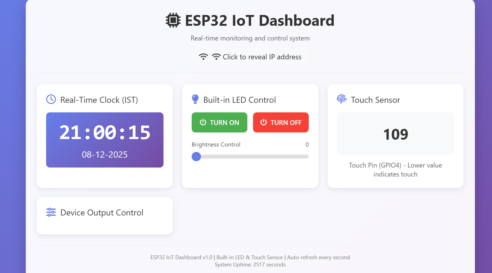

# ESP32 Built-In Sensor Web Control System

A lightweight, local web-based control dashboard for the ESP32 using only **built-in hardware features** — the onboard LED and capacitive touch sensor — with **no external modules required**.

This project demonstrates how to transform an ESP32 into a full real-time Web Control Interface using only HTML, CSS, and native Arduino libraries.

---
## 📸 Dashboard Preview

<p align="center">
  
</p>

<p align="center">
  <em>A clean and responsive web dashboard running directly on the ESP32.</em>
</p>


## 🚀 Features

### 🌐 Local Web Dashboard
- Served directly from the ESP32  
- Works on mobile & desktop  
- Auto-refresh without page reload  

### ⏱ Real-Time Clock (IST)
- Time synchronized with NTP  
- Live display (updated every second)

### 💡 Built-In LED Control
- Toggle ON/OFF  
- Smooth PWM brightness control (0–255)

### 🖐 Capacitive Touch Sensor (GPIO4)
- Shows live touch readings  
- Useful for simple touch-based interaction

### 🔒 Privacy-Aware Design
- ESP32 IP address **not embedded in HTML**  
- Revealed only through `/system/info` API when user clicks "Reveal IP"

### 📊 System Insights
- Chip ID  
- Free heap memory  
- Uptime tracking  

## Repository Structure

```
📁 ESP32-Built-In-Sensor-Web-Control-System/
│
├── src/
│   ├── main.ino
│   ├── config.h.example     # Copy → config.h (do NOT commit config.h)
│
├── assets/
│   ├── demo.gif             # GIF demo of dashboard
│   ├── screenshot.png       # Dashboard screenshot
│
├── docs/
│   ├── architecture-diagram.png   # Optional system diagram
│
├── README.md
├── CONTRIBUTING.md
├── LICENSE
└── .gitignore
```


## 🛠 Hardware Requirements

- ESP32 DevKit (any model: ESP32-WROOM, NodeMCU-32S, DOIT board, etc.)
- USB cable  
- No external components required

### Default Pin Mapping
| Feature | GPIO Pin |
|--------|----------|
| Built-in LED | GPIO 2 |
| Touch Sensor | GPIO 4 |
| Output Pins | GPIO 5, 18, 19 |

---

## 🧩 Software Requirements

- Arduino IDE or PlatformIO  
- ESP32 Board Package (`2.0.14` or `2.0.17` recommended)  
- Required libraries:  
  - `WiFi.h`  
  - `WebServer.h`  
  - `time.h`

---

## ⚙️ Setup Instructions

### 1️⃣ Clone the repository

```bash
git clone https://github.com/VaishakSCEM543/ESP32-Built-In-Sensor-Web-Control-System.git
cd ESP32-Built-In-Sensor-Web-Control-System
```

### 2️⃣ Configure Wi-Fi

Create your local config file:

cp src/config.h.example src/config.h


Then edit config.h and add your credentials:

const char* WIFI_SSID = "YourWiFi";
const char* WIFI_PASSWORD = "YourPassword";


⚠️ config.h should NOT be committed (it stays private).

```
```
### 3️⃣ Flash the Firmware

Open src/main.ino in Arduino IDE

Select your ESP32 board

Upload

```
```
### 4️⃣ Access the Dashboard

After uploading, open the Serial Monitor and get your ESP32 IP:

[WiFi] Connected. IP: 192.168.x.x


Then open the dashboard in your browser:

http://<your-esp32-ip>/
```
```

### 🌟 Why This Project Is Unique

Runs fully on internal ESP32 hardware

No shields, sensors, or external circuits required

Clean architecture and folder structure

Professional UI and usable control system

```
```
### Great for:

Mini-projects

Lab submissions

IoT learning

Portfolio building

Embedded dashboard design practice
```
```

### 🔮 Future Enhancements

WebSockets for ultra-fast real-time updates

Multi-tab dashboard

Graphs & analytics

Light/Dark theme

Secure login system
```
```

### 📜 License

This project is licensed under the MIT License.

```
```
### 🤝 Contributing

Contributions, feature requests, and improvements are welcome!
Submit an issue or open a PR anytime.
